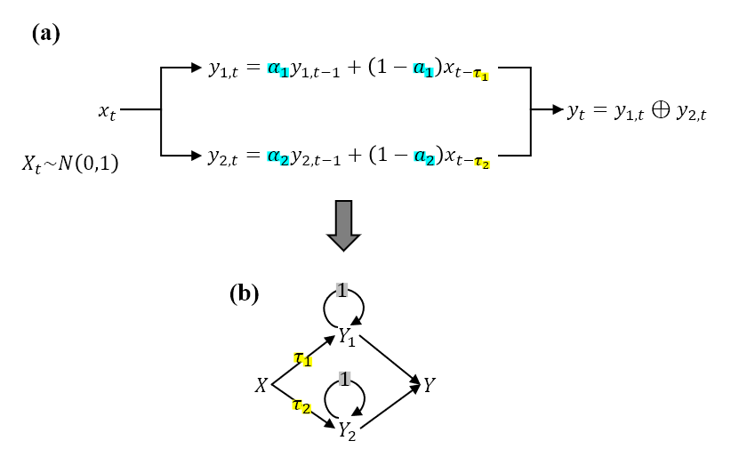
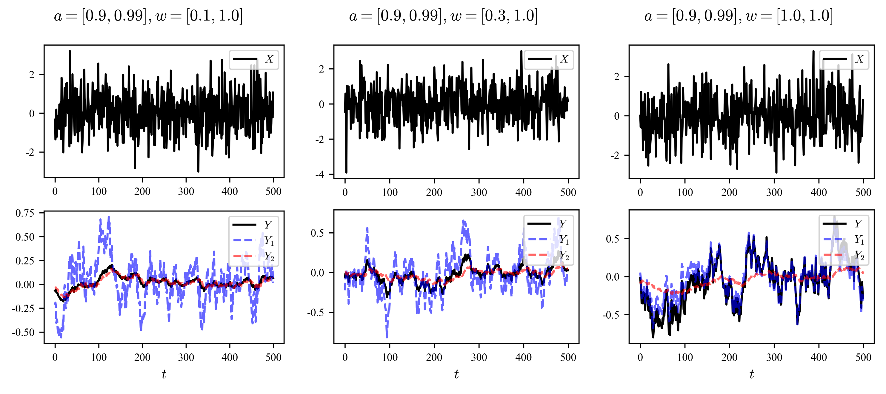
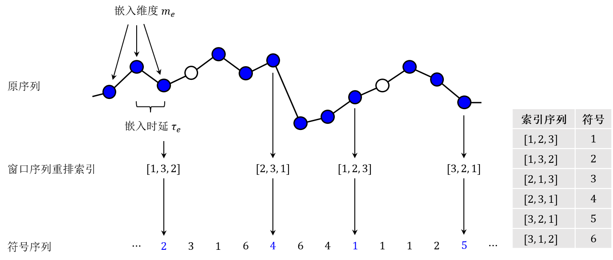
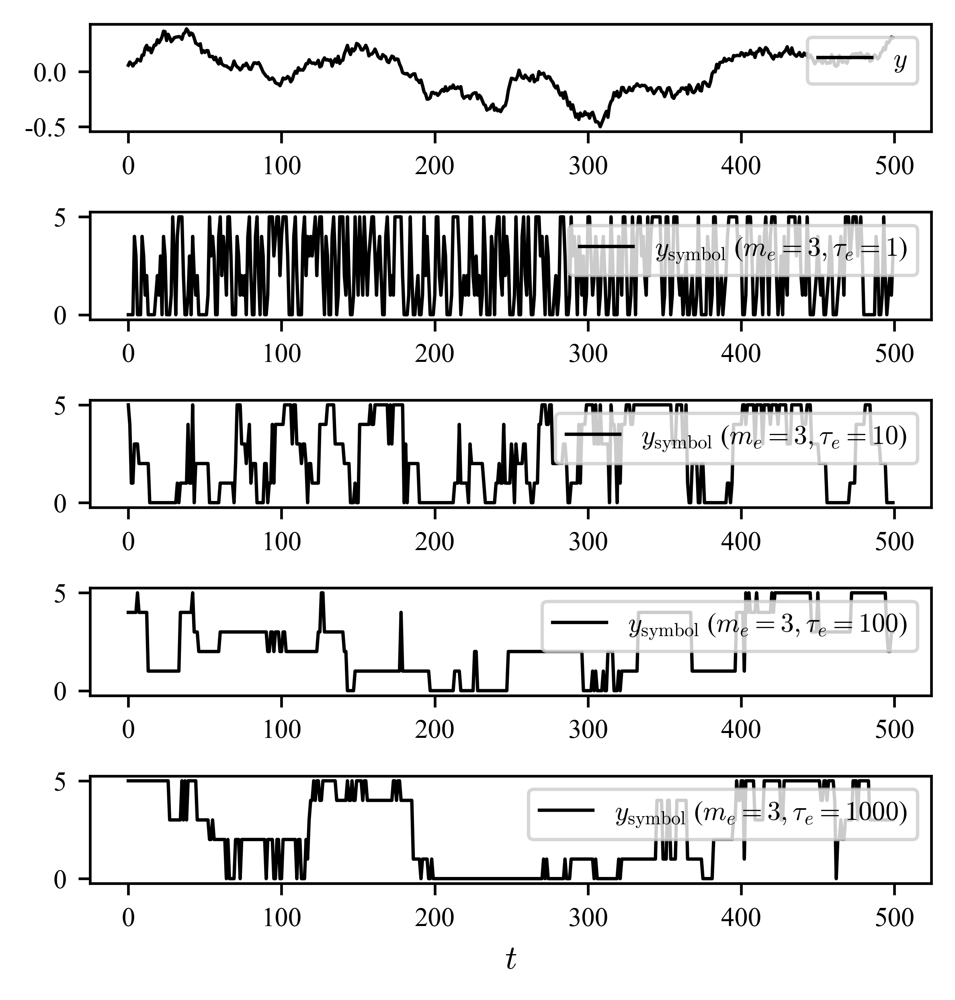
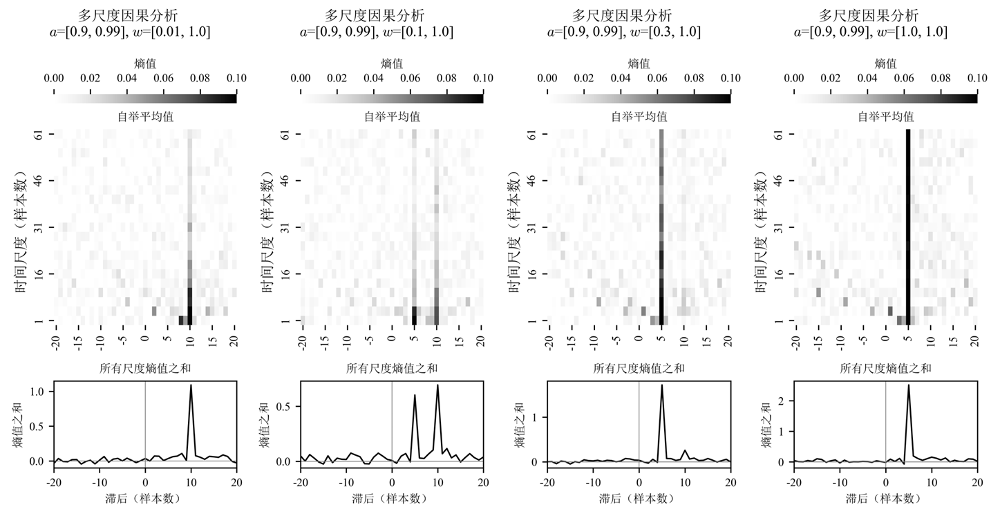

# 多尺度时序因果分析

如何从时序信号数据中准确识别与目标变化相关的驱动因子，进而构建更加精简、可解释的预测模型，是时序分析领域的一个重要研究课题。本文将介绍一种基于<mark>符号化分解</mark>的<mark>多尺度时序因果分析方法</mark>，旨在帮助读者理解如何从时序数据中有效提取时序因果关系信息。

### 一、多尺度时序作用案例

设计如下图所示的案例：

图(a)展示了信号间的时序计算关系。其中，$t$ 表示时刻，信号源 $X$ 是一个均值为 0、标准差为 1 的高斯白噪声。$X$ 分别以不同的强度 $1-a_1$、$1-a_2$ 和滞后 $\tau_1$、$\tau_2$ 影响 $Y_1$ 和 $Y_2$。此外， $Y_1$ 和 $Y_2$ 还分别受到由 $a_1$、$a_2$ 调控的上一时刻状态的影响，具有不同时间尺度的自相关特性。最终，$Y_1$ 和 $Y_2$ 通过融合形成总输出 $Y$。这样一来， $Y$ 中包含了来自 $X$ 的不同滞后和时间尺度的信息，换言之，$X$ 对 $Y$ 具有多尺度多滞后的时序因果作用。

图(b)展示了对应于图(a)的变量因果作用有向图，箭头上的符号数字表示作用滞后。各信号值计算式如下：

$$
\begin{align*}
X_t & \sim \mathcal{N}(\mu=0, \sigma=1) \\
Y_{1,t} & = a_1Y_{1,t-1} + (1-a_1)X_{t-\tau_1} \\
Y_{2,t} & = a_2Y_{2,t-1} + (1-a_2)X_{t-\tau_2} \\
Y_t & = Y_{1,t} \oplus Y_{2,t}
\end{align*}
$$

式中 $\oplus$ 表示信号融合操作，在本文中将采用 $w_1$、$w_2$ 对 $Y_1$、$Y_2$ 加权求和的方式：$Y_t = w_1 Y_{1,t} + w_2 Y_{2,t}$，后续讨论将表明：<mark>不同权重分配将影响最终输出 $Y$ 中的主导信号特征，进而对因果分析结果产生影响</mark>。

下图分别显示了当 $a=[0.9, 0.99]$ 时，不断增加 $w_1$ 所得信号样本：

可见，$Y_1$ 和 $Y_2$ 分别构成了 $Y$ 的高频和低频成分，随着 $w_1$ 的增加，$Y$ 中 $Y_1$ 的成分逐渐增强，最终主导了 $Y$ 的变化。

### 二、非平稳序列的多尺度符号化分解

采用符号化技术[^1]对<mark>一维平稳或非平稳</mark>的<mark>连续</mark>时序数据</mark>进行编码分解，得到不同时间尺度上的<mark>离散</mark>符号序列，便于后续分析。序列的符号化原理如下所示：

关键参数为<mark>嵌入维度 $m_e$ </mark>（通常为3-5）和<mark>嵌入滞后 $\tau_e$ </mark>（$\tau_e$ 越小时间尺度越短，$\tau_e$ 越大时间尺度越长）。因此，在固定 $m_e$ 的情况下，从小到大设置 $\tau_e$ 进行符号化，便可将原始时序数据分解为不同时间尺度上的符号序列。每个符号序列的长度为 $N - (m_e-1)\tau$，其中 $N$ 为原始时序数据的长度。

下图展示了对 $Y$ 按照不同尺度参数进行符号化分解的示例，由于 $m_e=3$，离散后取得 $m_e! =6$ 种状态符号：

### 三、多尺度时序因果分析

对 $X$ 和 $Y$ 序列数据进行多尺度分解，将结果代入时序因果分析算法进行计算，以探究其潜在的因果关系。设 $X$ 和 $Y$ 按照时间尺度 $\tau$ 分解后的符号序列分别为 $X^{(\tau)}$ 和 $Y^{(\tau)}$，采用<mark>动量信息传递（MIT, Momentum Information Transfer）</mark>算法[^2]对二者间的时序因果关系进行识别分析。

MIT算法源于传递熵（TE, Transfer Entropy）[^3]，但在计算过程中引入了因变量的额外历史状态作为条件集合，能够更好地捕捉时序数据中的因果关系和滞后效应。对于符号序列 $X^{(\tau)}$ 和 $Y^{(\tau)}$，TE和MIT的计算公式如下：

$$
\begin{align*}
I^{\rm TE}_{X \to Y}(\tau) & = I(X_{t-\tau};Y_t|Y_{t-1}) \\
I^{\rm MIT}_{X \to Y}(\tau) & = I(X_{t-\tau};Y_t|X_{t-\tau-1}, Y_{t-1}) \\
\end{align*}
$$

其中，$I(\cdot|\cdot)$ 表示条件互信息，计算涉及<mark>概率估计</mark>和<mark>统计检验</mark>，细节参见文末参考资料，此处按下不表；$\tau$ 表示待检测的 $X\to Y$ 的滞后，如果 $X$ 对 $Y$ 具有显著的滞后因果作用，则TE和MIT的熵值将会在对应的滞后 $\tau$ 处呈现显著的峰值。

下图显示了采用MIT对本文案例所述系统进行分析所得结果。分析采用Bootstrap自举方式从系统中循环地（100轮）抽取100个独立样本，然后汇总所有滞后上计算所得的MIT熵值和背景值（由置换检验获得），最终绘制MIT熵值随滞后和时间尺度的变化关系：

图中，从左往右，输出 $Y$ 中 $Y_1$ 信号权重逐渐增强，同时 $Y_2$ 信号权重不变：
1. 当 $Y_1$ 信号权重很小（$w_1=0.01$）时（最左图），输出 $Y$ 中 $Y_2$ 占主导地位，MIT 算法仅能检测出 $X$ 对 $Y$ 在滞后 $\tau_2 = 10$ 处的因果作用；
2. 当 $Y_1$ 信号权重较大（$w_1\geq0.3$）时（最右两张图），输出 $Y$ 中 $Y_1$ 占主导地位，MIT 算法相应地只检测出 $X$ 对 $Y$ 在滞后 $\tau_1 = 5$ 处的因果作用；
3. 值得注意的是，只有当权重取中等值（$w_1=0.3$）时，MIT 算法才能同时检测出 $X$ 对 $Y$ 在 $\tau_1 = 5$ 和 $\tau_2 = 10$ 处的双重因果作用。此外，该图显示 $X$ 对 $Y_1$ 成分作用对应尺度比 $Y_2$ 更小。

本案例中的多尺度现象只有在合适的权重设置下才会出现，<mark>并非普遍现象</mark>。

[^1]: M. Staniek and K. Lehnertz, "Symbolic Transfer Entropy", Physical Review Letters, 2008.
[^2]: B. Pompe and J. Runge, "Momentary information transfer as a coupling measure of time series", Physical Review E, 2011.
[^3]: T. Schreiber, "Measuring Information Transfer", Physical Review Letters, 2000.

