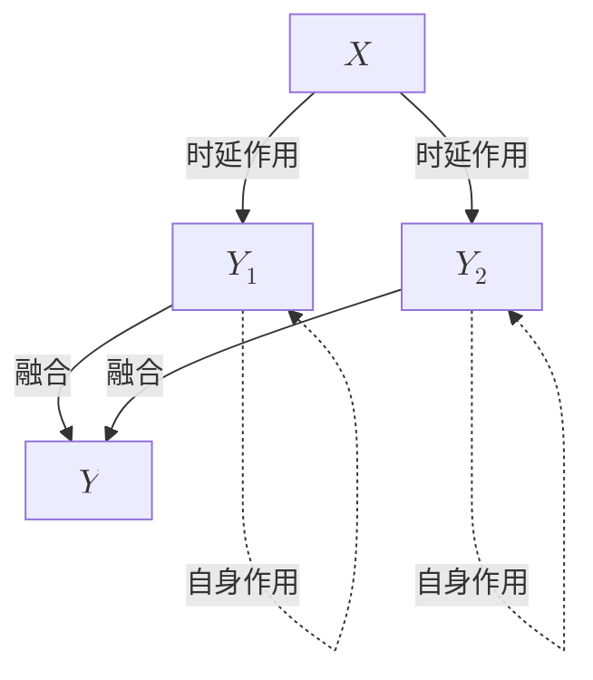

# 多尺度时序因果分析

## 一、耦合系统案例

设计如下的案例：

信号源 $X$ 是一个均值为 0、标准差为 1 的高斯白噪声序列。$X$ 分别以不同的强度和时延影响 $Y_1$ 和 $Y_2$，而 $Y_1$ 和 $Y_2$ 各自还具有自相关特性。最终，$Y_1$ 和 $Y_2$ 通过融合形成输出 $Y$，使得 $Y$ 中包含了来自 $X$ 的多种时延和时间尺度的因果信息。

$$
X_t \sim \mathcal{N}(\mu=0, \sigma=1)
$$

